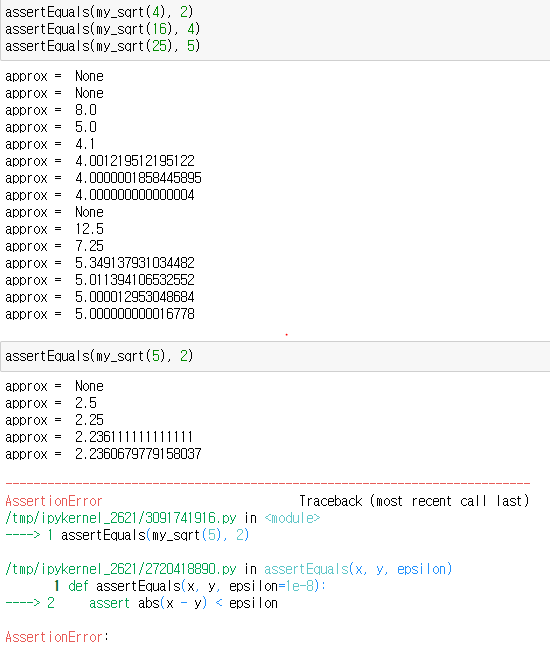

# 210802 ( Fuzzing Notes )

## Introduction to Software Testing

### `Newton-Raphson Method`

`Newton-Raphson Method` looks like a `Gradient Descent Algorithm`

$ x_{n+1} = x_n - \frac{f(x_n)}{f'(x_n)} $ when finding root 

<!-- $ = x_n - \frac{\sqrt{x_n}} {\frac{1}{2}\frac{1}{\sqrt{x_n}}} $

$ = x_n - 2\sqrt{x_n}\sqrt{x_n} $

$ = x_n - 2x_n $ 

$ x_{n+1} = - x_n $  -->

[How Newton-Raphon Method work](https://brilliant.org/wiki/newton-raphson-method/)

`Newton-Raphson's Method` 가 언제까지 실행되는가는 예측 값과 실제 값이 충분히 작은 수가 되었을 때이다. 수학적으로 정확히 일치는 되 기 힘들지만 점점 수렴하는 것을 볼 수 있다. 본문에는 이가 표시가 안 된 것은 컴퓨터에서는 어느정도 크기까지만 값을 저장하기 때문이다.

이 값이 맞다는 것은 어떻게 확인을 할까?
Testing 을 위해 `assert`를 사용. assert를 사용하지 맞지 않은 값에서는 에러가 뜨는 것을 확인할 수 있다.

이 후에는 각각의 `input`이 걸리는 시간을 반복문을 이용하여서 여러개의 `random samples` 로 test하였다.

`Epsilon` 이라는 임의의 값을 지정하여 우리가 만든 허용범위 안에 값이 만들어 진다면 test를 통과한것. 

하지만 Automatic runtime-check시 두가지를 염두해야한다.

1. 값이 맞다는 것을 정확하게 표현해야한다. 이것이 쉽지 않기 때문. 중요한 부분을 집중하여 확인해야함.
2. run-time testing을 할만큼의 자원이 있어야한다. 시간, 계산량 등 매우 오래걸리는 일이 매우 단순한 일을 테스팅한다면 낭비가 되는 것 일 수 도 있다.

### User-input

Unexpected 값은 software bug를 야기한다. 다음 그림은 위의 프로그램을 사용자가 값을 넣는 프로그램으로 바꿔주었고 그 input 값에 -1 이라는 값을 넣어주었다. 당연히 프로그램은 갈피를 못 잡고 negative로 수렴 혹은 발산하며 무한 루프를 돌게된다.  

이를 막기위해 interrupt library를 사용하여 1초후에도 프로그램이 돌고 있다면 프로그램을 멈추는 방식이 있을 것이다. 하지만 이는 exception을 부르니 들어오는 값의 정당성 확인하는 식의 프로그램을 짤수가 있을 것이다. 하지만 이 또한 사람이 하는 일이기 때문에 모든 수를 확인 할 수가 없고 there could be exceptions that humen missed.

## References
- [fuzzingNotebook](fuzzingbook.org)